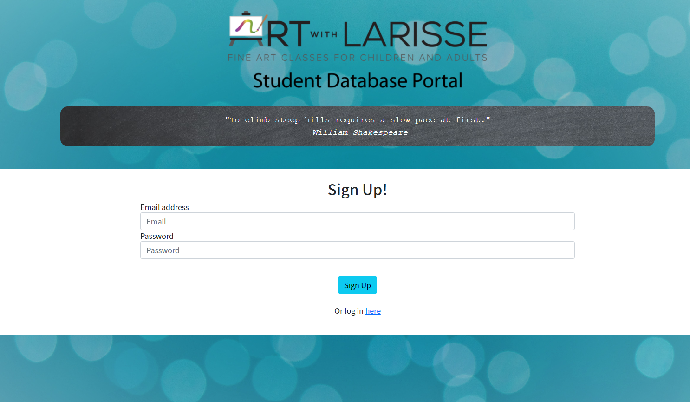
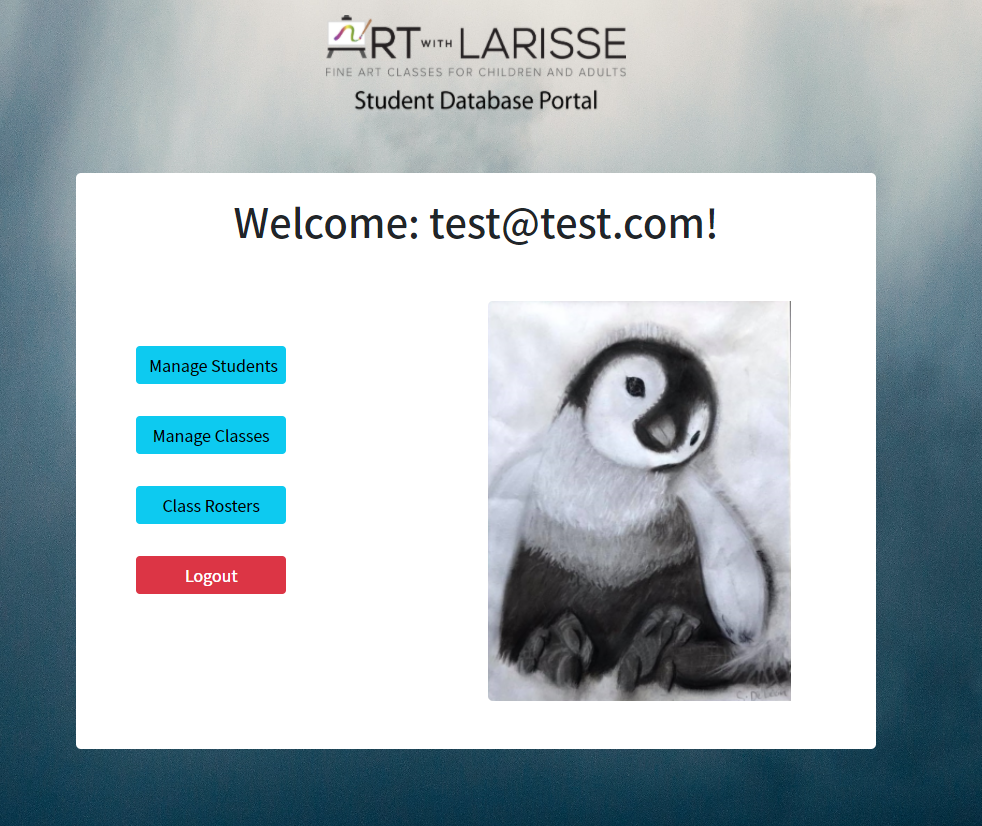
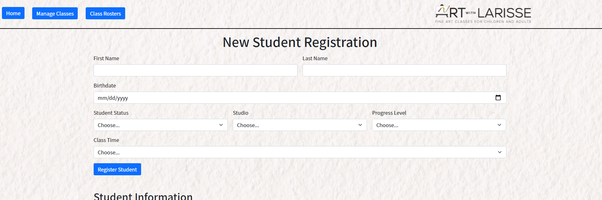
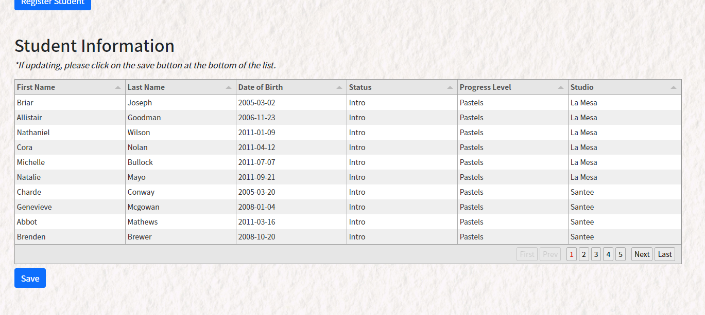
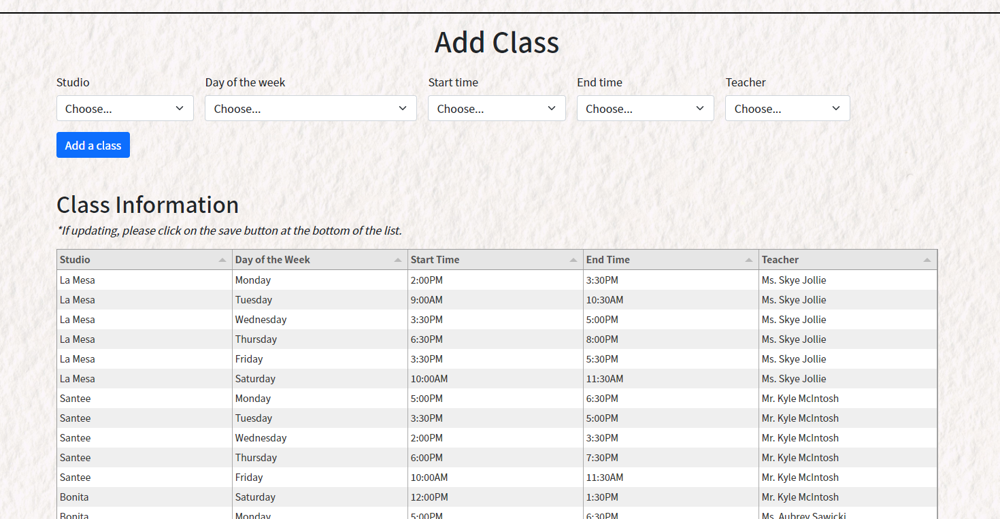
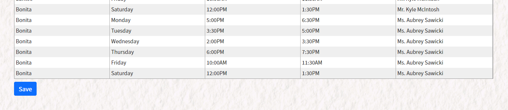
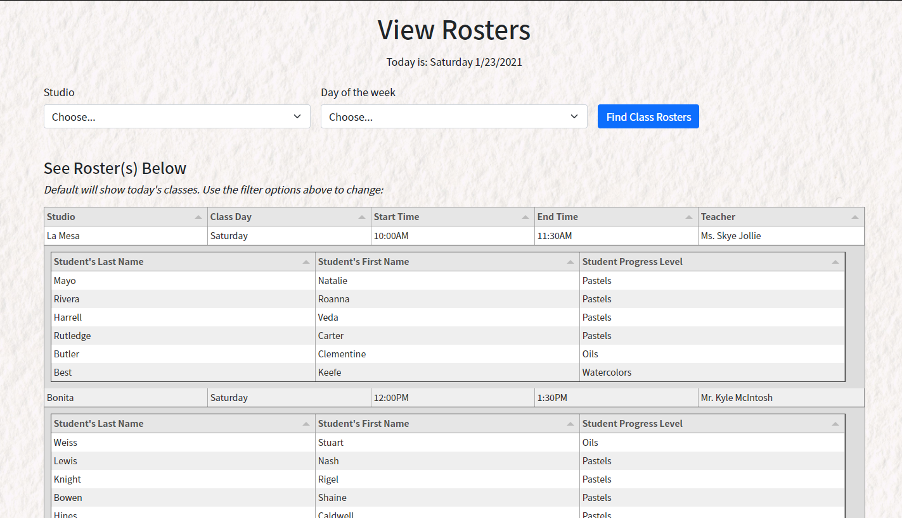

# Art With Larisse: Student Database Portal 🎨🖌️🖼️

 
  
  
  
  
    
  
  
  
  

## Table of Contents
* [Description](#description)
* [Usage](#usage)
* [Contributors](#contributors)
* [License](#license)

## Description

This is a teacher portal to help manage the students and classes for the awe-inspiring San Diego Art Studio: Art With Larisse!  Once a teacher signs up and logs in, they will be able to manage and add student information, manage and add class information, and view the clsas rosters! 

Please click [here](https://student-registration-tracker.herokuapp.com/) to view this site!

## Usage

⭐When you first pull up the site, a teacher will be able to enter in an e-mail and password to sign up to use the app (if they already have existing credentials, they may click on the login link to log in with their e-mail and password instead! 

⭐Once the teacher logs in, they will be directed to the dashboard page, where they will see options to manage students, manage classes, or view class rosters. 

⭐In manage students, a form will show at the top of the page in which a teacher can register a new student (if necessary). 

⭐Below the form, there will be a table of all the students registered for the art studio.  Due to the large amount of students, this table will only show 10 students at a time (the bottom-right of the table will give the user the option to select another page).  The user will also be able to make changes within the table, and then save their changes using the save button below the table. 

⭐In manage classes, a form will show at the top so a teacher may add another class time to the class information table (if necessary). 

⭐Below the form, a table will show with all classes currently registered, and a teacher may update some items within the table (in which they will save their changes using the save button below the table). 

⭐In Class Rosters, a table will be displayed and will automatically populate classes (and the students set for each class) for the current day of the week.  A form will be above this table in which a teacher may select a specific studio and specific day of the week to pull up a table with the filtered parameters. 

## Contributors
🎨[Michael Bubel](https://github.com/mbubel)
🎨[Charles Robinson](https://github.com/CDRobinsonIII)
🎨[Christina Shiroma](https://github.com/Christina2021)
🎨[Emily Thomas](https://github.com/ethomas22)

## License
[MIT](https://choosealicense.com/licenses/mit/#)
